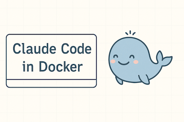

# ai-tools

I put it in a container, and you can too if you want.



### Quick Start

1. Create a persistent volume
```bash
$ docker volume create aiuser-home
```

2. Build the container image
```bash
$ docker build -t ai-tools:latest .
```

3. Run it with or without a workspace
```bash
$ ./run.sh <optional workspace>
```

### Why

Claude seems to be persistently bad at obeying its own folder permissions. This leads to concerns about access to directories and files that Claude simply shouldn't have access to. Since denying READ/WRITE/EDIT through Claude's configuration file has no impact, the best solution is to either restrict based on system file permissions or sandbox in a Container. I chose the latter solution.

### Data

Claude will put its data to the home directory of `aiuser` which is backed by a persistent volume. This means while the container is ephemeral, the data in that directory is persisted.

### Optional Workspace

The `run.sh` script is just a dumb wrapper on the `docker run` command. It accepts either no argument or a single argument. If given an argument, it must be a path that exists on your host. It will then bind mount this to a location under `/mnt/Project/` in the Container. Claude can then work with those files.
